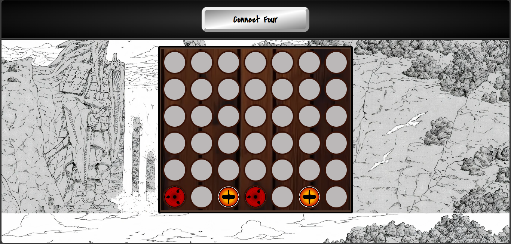
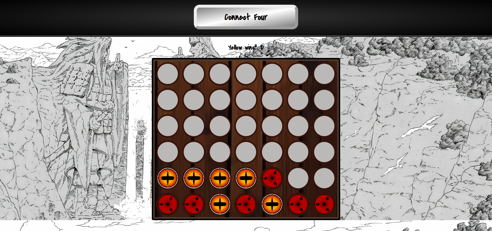
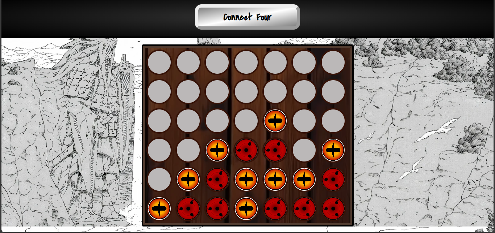

# js-connect-four-tutorial

1/21/24
Warming up for my tic tac toe project by following the Connect Four JavaScript tutorial here > https://www.youtube.com/watch?v=4ARsthVnCTg

11/30/24
Today I am revisiting this old project and adding a bit of my own style to it. 

I kept the base game functionality and added elements from one of my favorite shows to the webpage.

Background src image web link: https://wallpapercave.com/wp/wp10715133.jpg

Sharingan src web link: https://vignette.wikia.nocookie.net/narutofanon/images/8/89/Sassyruto's_Sharingan.png/revision/latest?cb=20150923023125

Sage mode src web link: https://th.bing.com/th/id/R.65f98b3f5cfadb6df51bde0130fbb8f1?rik=BC7KyzVzd8%2fm%2bQ&pid=ImgRaw&r=0

Wooden gameboard texture src web link: https://pics.craiyon.com/2023-06-26/d6bda378163840f48112b0131bfb12cd.webp

